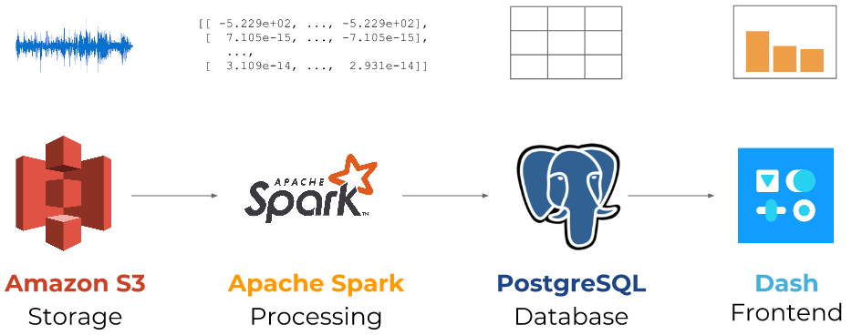

# Listen Up

Speech data pipeline for non-native accents.

## Motivation

From Amazon Alexa to Google Home, smart speakers are becoming elemental to the modern home. While speech recognition accuracy is improving, not everyone can participate in this new technology. According to the Washington Post, users from other countries speaking English experienced on average 30% more inaccuracies while using Amazon Alexa, a result comparable to other speech technologies. Improving speech recognition for non-native accents increases the addressable market and helps build a more inclusive world. Listen Up facilitates the collection and processing of this audio data to generate structured data as input for machine learning models.

## How It Works

One of the big hurdles to improving speech recognition algorithms is storing and processing audio data. Listen Up tackles this by storing 100GB of speech audio data in S3, then distributing the processing across a cluster of Apache Spark workers. This allows time-intensive data calculations to be parallelized across many nodes and speed up the total processing time. Afterwards, the data is stored in PostgreSQL and visualized using Dash. The data pipeline is designed to speed up training for Data Scientists. The database can be queried directly to extract training data. The project also offers a frontend to monitor processing status and data availability.

View available speech data at <a href="http://listenup.site/">Listen Up</a>.

## Data Pipeline

## Features

1. 100GB of audio files available for training in S3.
2. Audio file processing in Apache Spark to extract mel-frequency cepstrum data.
3. High availability database serves up preprocessed data for speech recognition ML algorithms.
4. Data pipeline monitoring for data engineering and devops.

## What's To Come

1. Additional preprocessing features, including standardizing bitrate, audio codec, volume normalization, and removing silence from clips.
2. User-submitted audio, to improve speech recognition for an even broader range of accents.
2. Mechanical Turk integration, to automate audio file transcription where not included in the dataset.

## Audio Data Sources

Mozilla Common Voice Dataset
* https://voice.mozilla.org/en/datasets

Recordings of African Accented French speech
* http://www.openslr.org/57/

English speech recognition training corpus from TED talks
* http://www.openslr.org/7/

Large-scale corpus of read English speech
* http://www.openslr.org/12/

## Contact
Reach out to dustin.harris@outlook.com with any questions.
